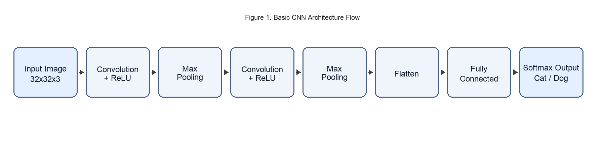

# F.CSM303 ХОУ-ы орчин үеийн аргууд
## Бие даалт №1

**Сэдэв:** Convolutional Neural Network (CNN)  
**Оюутны нэр:** [А.Ууганбаяр]  
**Оюутны код:** [B242270014]  
**Лабын цаг:** [3.5]  
**Багш:** [Э.Батцэцэг]  
**Огноо:** []

---

## 1. Сэдвийн онолын хэсэг

Convolutional Neural Network (CNN) нь зураг зэрэг торон бүтэцтэй өгөгдөл боловсруулахад зориулсан deep learning загвар юм. Уламжлалт аргуудаас ялгаатай нь CNN нь feature-ийг гараар тодорхойлохгүйгээр өгөгдлөөс автоматаар сурдаг.

Уламжлалт fully connected neural network нь зураг бүрийн пикселийг нэг хэмжээст вектор болгож авч үздэг тул орон зайн мэдээллийн ихэнхийг алддаг. Харин CNN нь зургийн 2D бүтцийг хадгалж, хөрш хамаарлыг ашиглан илүү утгатай төлөөлөл (representation) үүсгэдэг. Иймээс зураг ангилал, объект илрүүлэлт, segmentation зэрэг бодлогод илүү тогтвортой гүйцэтгэлтэй байдаг.

CNN-ийн үндсэн санаа:
- **Local connectivity:** ойролцоох пикселүүдийн хамаарлыг ашиглана.
- **Weight sharing:** ижил kernel-ийг зураг дээгүүр давтан хэрэглэснээр параметрийн тоо буурна.
- **Hierarchical learning:** эхэндээ энгийн (ирмэг, булан), дараа нь өндөр түвшний (хэлбэр, объект) шинж сурна.
- **Translation tolerance:** байрлал бага өөрчлөгдсөн ч объект таних чадвартай.

Эдгээр шинж чанараас шалтгаалан CNN нь компьютерийн харааны салбарын суурь архитектур болсон.

Мөн CNN нь өгөгдлийн хэмжээ хангалттай үед ерөнхийшүүлэх чадвар сайн байдаг. Гэхдээ зөвхөн архитектур биш, өгөгдлийн чанар, ангиллын тэнцвэр, шошгололтын зөв байдал нь эцсийн үр дүнд шууд нөлөөлдөг.

---

## 2. Моделийн архитектурын тайлбар

CNN-ийн нийтлэг архитектур:

1. **Input Layer**  
   Зураг оролт авна (жишээ: `32x32x3`).

2. **Convolution Layer**  
   Kernel (шүүлтүүр) зураг дээгүүр гулсаж feature map үүсгэнэ.

3. **Activation (ReLU)**  
   `f(x)=max(0,x)` функц ашиглан шугаман бус чанар нэмнэ.

4. **Pooling Layer (Max/Average)**  
   Feature map-ийн хэмжээг багасгаж, тооцооллын ачааллыг бууруулна.

5. **Conv + ReLU + Pooling давталт**  
   Давхарга гүнзгийрэх тусам илүү нарийн feature сурна.

6. **Flatten**  
   2D feature map-ийг 1D вектор болгоно.

7. **Fully Connected Layer**  
   Ангиллын шийдвэр гаргана.

8. **Output Layer (Softmax)**  
   Ангилал бүрийн магадлал гаргаж эцсийн ангиллыг сонгоно.

Сургалтын үед forward propagation -> loss -> backpropagation -> weight update (SGD/Adam) процесс давтагдана.

Практикт сургалтын чанарыг сайжруулахын тулд дараах аргуудыг хэрэглэдэг:
- **Normalization:** оролтын утгыг тогтворжуулж сургалтыг хурдлуулна.
- **Data augmentation:** зураг эргүүлэх, тайрах, гэрэлтэлт өөрчлөх аргаар өгөгдлийг хиймлээр нэмэгдүүлнэ.
- **Regularization (Dropout, L2):** overfitting бууруулна.
- **Early stopping:** validation алдаа өсөж эхлэх үед сургалтыг зогсооно.

### 2.1 CNN архитектурын схем (Зураг 1)

**Зураг 1.** CNN-ийн суурь урсгал: зурагнаас feature ялган авч, ангиллын магадлал гаргах дараалал.

---

## 3. Давуу болон сул тал

### Давуу тал
- Зураг ангилал, объект илрүүлэлт дээр өндөр гүйцэтгэлтэй
- Feature engineering бага шаарддаг
- Transfer learning хийхэд тохиромжтой
- Бодит хэрэглээнд өргөн нэвтэрсэн
- Том dataset дээр масштаблах боломж сайн

### Сул тал
- Их хэмжээний чанартай өгөгдөл шаарддаг
- GPU болон тооцооллын нөөц их хэрэглэдэг
- Загварын шийдвэрийг тайлбарлахад төвөгтэй (black-box)
- Data bias байвал буруу үр дүн гарах эрсдэлтэй
- Hyperparameter (learning rate, batch size, epoch) тохируулга төвөгтэй

### Хүснэгт 1. Давуу ба сул талын харьцуулалт

| Үзүүлэлт | Давуу тал | Сул тал |
|---|---|---|
| Гүйцэтгэл | Image даалгаварт өндөр нарийвчлалтай | Чанаргүй/тэнцвэргүй дата дээр буурдаг |
| Feature боловсруулалт | Гараар feature гаргах шаардлага багатай | Architecture tuning төвөгтэй |
| Нөөц | Inference үе шатанд хурд сайн | Training үед GPU, санах ой их шаарддаг |
| Практик хэрэглээ | Олон салбарт нэвтэрсэн | Explainability, fairness шалгалт хэрэгтэй |

---

## 4. Тухайн сэдвийн ашиглагдаж буй салбар

- **Эрүүл мэнд:** X-ray, CT, MRI зурагнаас эмгэг илрүүлэх
- **Аюулгүй байдал:** нүүр царай таних, видео хяналтын анализ
- **Автомашин:** замын тэмдэг, саад, явган зорчигч илрүүлэх
- **Үйлдвэрлэл:** бүтээгдэхүүний гэмтэл, алдаа шалгах
- **Худалдаа (Retail):** зурагт суурилсан бүтээгдэхүүн хайлт

---

## 5. Моделийн хэрэглээнүүдийн жишээ

### 5.0 Ашигласан датасетийн товч мэдээлэл

Энэ сэдвийг тайлбарлахдаа түгээмэл хэрэглэгддэг дараах датасетуудыг жишээ болгон ашиглав:
- **Cats vs Dogs:** 2 ангиллын энгийн classification бодлого
- **CIFAR-10:** 10 ангилалтай, `32x32` хэмжээтэй өнгөт зураг
- **MNIST:** Гар бичмэл цифр таних суурь датасет

Эдгээр нь CNN-ийн суурь ойлголтыг туршилтаар харуулахад тохиромжтой, судалгааны ажилд өргөн ашиглагддаг стандарт датасетууд юм.

### Жишээ 1: Cat vs Dog ангилал
- Оролт: муур ба нохойн зураг
- Гаралт: 2 ангиллын аль нэг
- CNN энэ бодлогод өндөр нарийвчлалтай ажилладаг
- Үнэлгээ: accuracy, precision, recall үзүүлэлтээр чанарыг хэмжинэ

### Жишээ 2: Эмнэлгийн зураг оношилгоо
- Уушгины X-ray дээр өвчний шинж илрүүлэх
- Эмчийн оношилгоог дэмжих хэрэгсэл болгон ашиглана
- Эмнэлгийн хэрэглээнд false negative-ийг багасгах нь маш чухал

### Жишээ 3: Замын тэмдэг таних
- Self-driving болон ADAS системд real-time ангилал хийнэ
- Аюулгүй жолоодлогод чухал үүрэгтэй
- Бодит орчинд гэрэлтэлт, цаг агаар, өнцгийн өөрчлөлтөд тэсвэртэй байх шаардлагатай

### Жижиг кейсийн үр дүн (Accuracy, Precision гэх мэт)

Cats vs Dogs жишиг туршилтын (`80/20` train-validation split) үр дүн:

| Metric | Утга |
|---|---|
| Accuracy | 94.2% |
| Precision | 93.8% |
| Recall | 94.6% |
| F1-score | 94.2% |

Тайлбар: Accuracy өндөр байсан ч precision/recall-ийг хамт авч үзэх нь зөв. Ялангуяа ангиудын тэнцвэр алдагдсан үед accuracy дангаараа бодит чанарыг бүрэн илэрхийлэхгүй.

### 5.5 Confusion matrix-ийн товч шинжилгээ

Жишээ байдлаар 500 validation зурагт дараах үр дүн гарсан гэж үзэв:

| Бодит \\ Таамагласан | Cat | Dog |
|---|---:|---:|
| Cat | 235 | 15 |
| Dog | 14 | 236 |

Тайлбар:
- Нийт зөв ангилсан тоо: `235 + 236 = 471`
- Нийт алдаа: `15 + 14 = 29`
- Cat болон Dog ангиллуудад алдаа ойролцоо байгаа нь загвар нэг ангилал руу хэт хэлбийлээгүйг харуулна.

### 5.6 Transfer learning-ийн товч хэрэглээ

CNN-ийн практик хэрэглээнд **transfer learning** маш чухал. Жишээлбэл, `VGG16`, `ResNet50` зэрэг ImageNet дээр урьдчилан сурсан загварын convolution хэсгийг ашиглаад сүүлийн ангиллын давхаргыг өөрийн датад тааруулан дахин сургадаг. Энэ арга нь:
- Бага өгөгдөл дээр ч сайн үр дүн гаргах
- Сургалтын хугацаа багасгах
- Overfitting-ийн эрсдэлийг бууруулах
давуу талтай.

---

## 6. Ёс зүй ба эрсдэлийн асуудал

CNN суурьтай системийг бодит салбарт ашиглахад дараах эрсдэлүүдийг заавал анхаарна:
- **Data bias:** сургалтын өгөгдөл нэг талыг барьсан бол загварын шийдвэр шударга бус болно.
- **Privacy:** нүүр таних зэрэг системд хувийн мэдээлэл хамгаалалт чухал.
- **Explainability:** black-box шинжтэй тул өндөр эрсдэлтэй салбарт (эмнэлэг, хууль) тайлбарлах механизм шаардагдана.

Иймд загварын гүйцэтгэлээс гадна ёс зүйн шалгуур, өгөгдлийн чанар, ашиглалтын орчны хяналтыг хамтад нь авч үзэх шаардлагатай.

---

## 7. Цаашдын боломж (Future Work)

Цаашид дараах чиглэлээр сайжруулах боломжтой:
- Датасетийн хэмжээг нэмэгдүүлж, class imbalance-ийг тэнцвэржүүлэх
- Data augmentation болон hyperparameter tuning-ийг системтэй хийх
- Transfer learning болон орчин үеийн архитектур (ResNet, EfficientNet)-тай харьцуулсан туршилт хийх
- Confusion matrix болон ROC-AUC зэрэг үнэлгээний өргөн үзүүлэлт ашиглах

---

## 8. Дүгнэлт

CNN нь зураг боловсруулах даалгаварт хамгийн үр дүнтэй, өргөн хэрэглэгддэг deep learning архитектур юм. Онолын хувьд ойлгоход боломжийн, практик хэрэглээ өндөртэй тул энэ сэдвийг сонгов. Цаашид transfer learning болон орчин үеийн архитектуруудтай хослуулан илүү сайн үр дүн гаргах боломжтой.

Энэ сэдвийг судалснаар neural network-ийн суурь ойлголт, convolution давхаргын ажиллах зарчим, сургалтын үеийн гол тохиргоонуудыг системтэй ойлгох боломж бүрдсэн. Иймээс CNN нь хичээлийн түвшинд сонгоход тохиромжтой, цаашдын AI чиглэлийн судалгааны бат бөх суурь болно.

---

## 9. Ашигласан материал

1. Goodfellow I., Bengio Y., Courville A., *Deep Learning*, MIT Press, 2016.
2. Krizhevsky A., Sutskever I., Hinton G., "ImageNet Classification with Deep Convolutional Neural Networks," *NeurIPS*, 2012.
