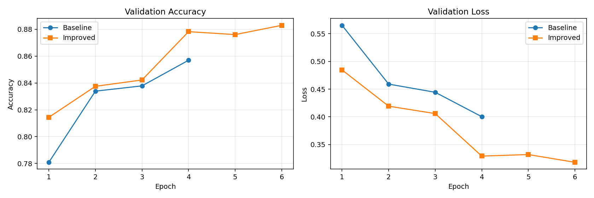
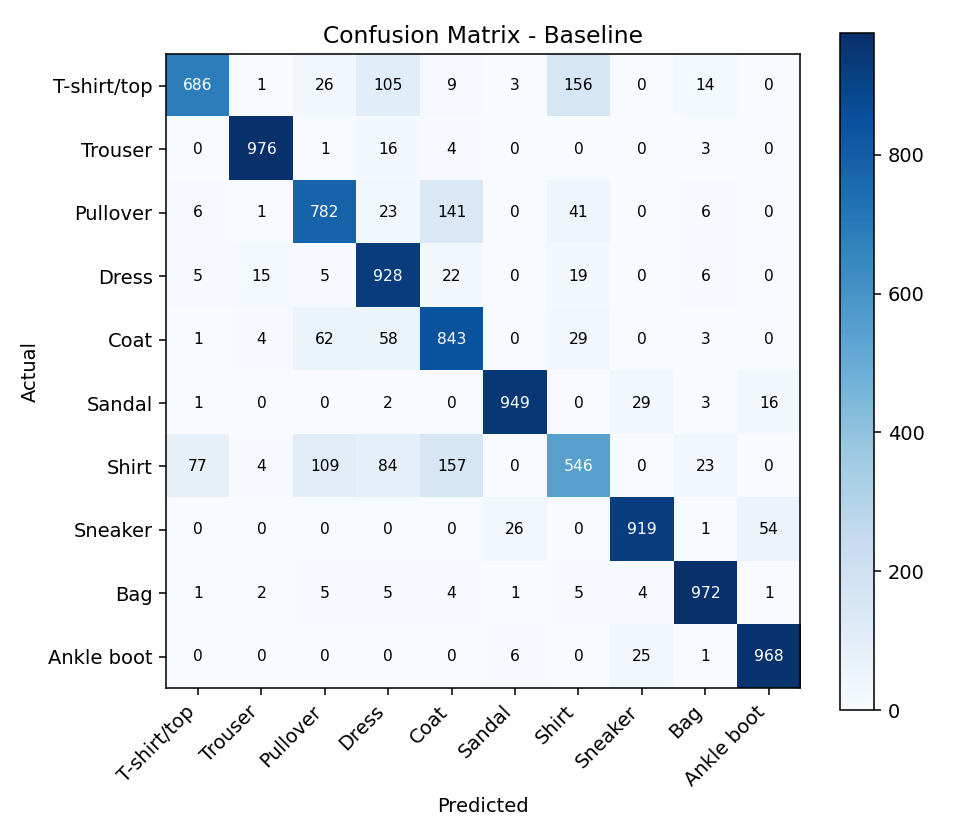
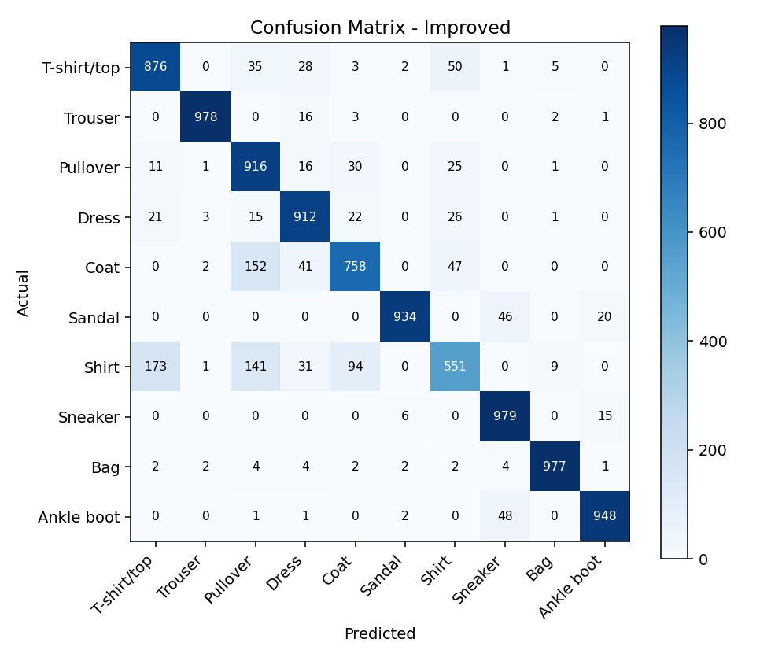
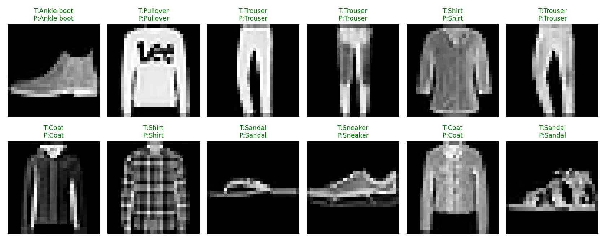

# F.CSM303 — ХОУ-ы орчин үеийн аргууд
## Бие даалт №2

**Сэдэв:** Convolutional Neural Network (CNN) — программ ажиллуулж үр дүнг сайжруулсан туршилт
**Оюутны нэр:** А.Ууганбаяр
**Оюутны код:** B242270014
**Лабын цаг:** 3.5
**Багш:** Э.Батцэцэг
**Огноо:** 2026-04-27

---

## 1. Зорилго

Бие даалт №1-ээр сонгосон CNN сэдвийн хүрээнд:

1. PyTorch ашиглан CNN загвар бичиж бодит дата (Fashion-MNIST) дээр сургах,
2. Энгийн (**Baseline**) ба сайжруулсан (**Improved**) хоёр хувилбарыг харьцуулах,
3. Сайжруулалтын нөлөөг тоо ба графикаар нотлох,
4. Кодыг алхам алхмаар тайлбарлах.

---

## 2. Туршилтын тохиргоо

| Үзүүлэлт | Утга |
|---|---|
| Framework | PyTorch 2.11 + torchvision 0.26 |
| Dataset | Fashion-MNIST (`28×28` саарал, 10 ангилал) |
| Train хэмжээ | 20,000 (хурдан туршилтын зорилгоор) |
| Test хэмжээ | 10,000 |
| Optimizer | Adam (`lr=1e-3`) |
| Loss | CrossEntropyLoss |
| Random seed | 42 (давтагдах боломжтой) |
| Төхөөрөмж | CPU |

Fashion-MNIST-ийг сонгосон шалтгаан: MNIST-ээс илүү төвөгтэй (хувцасны 10 ангилал), CNN-ийн боломжийг харуулахад тохиромжтой, CPU дээр ч хурдан сурдаг стандарт benchmark.

---

## 3. Архитектурын ялгаа

### 3.1 Baseline CNN (энгийн)

```
Conv(1→16, 3×3) → ReLU → MaxPool(2)
Conv(16→32, 3×3) → ReLU → MaxPool(2)
Flatten → Linear(1568→128) → ReLU → Linear(128→10)
```

- Параметрийн тоо: **206,922**
- Augmentation, BatchNorm, Dropout байхгүй

### 3.2 Improved CNN (сайжруулсан)

```
[Conv(1→32) → BN → ReLU] × 2 → MaxPool → Dropout2d(0.25)
[Conv(32→64) → BN → ReLU] × 2 → MaxPool → Dropout2d(0.25)
Flatten → Linear(3136→256) → BN → ReLU → Dropout(0.5) → Linear(256→10)
```

Нэмсэн арга техникүүд:

| Техник | Зорилго |
|---|---|
| **BatchNorm** | Сургалтыг тогтворжуулж, илүү өндөр learning rate-д тэсвэртэй болгоно |
| **Dropout (2d 0.25, 1d 0.5)** | Overfitting-ийг бууруулна |
| **Data augmentation** (RandomCrop, HorizontalFlip) | Сурах өгөгдлийн олон янз байдлыг нэмэгдүүлж generalization сайжруулна |
| **Weight decay (`1e-4`)** | L2 regularization үүрэгтэй |
| **Илүү гүн (32→64 channel)** | Илүү баялаг feature representation |

- Параметрийн тоо: **871,530** (≈4 дахин их)

---

## 4. Үр дүнгийн хүснэгт

Программ `python cnn_demo.py` командаар ажиллаж дараах үр дүн гарав:

| Metric | Baseline (4 epoch) | Improved (6 epoch) | Зөрүү |
|---|---:|---:|---:|
| Accuracy | **0.8567** | **0.8926** | **+3.59%** |
| Precision (macro) | 0.8583 | 0.8918 | +3.36% |
| Recall (macro) | 0.8567 | 0.8926 | +3.59% |
| F1-score (macro) | 0.8542 | 0.8912 | +3.70% |
| Параметр | 206,922 | 871,530 | ×4.2 |
| Сургалтын хугацаа | 14.8 сек | 118.9 сек | ×8.0 |

**Дүгнэлт:** Сайжруулсан загвар бүх metric дээр **3–4 нэгжээр** өндөр гарав. Параметр болон сургалтын хугацаа нэмэгдсэн ч accuracy/F1-ийн өсөлт, ялангуяа generalization-ийн талаас үнэ цэнэтэй.

### 4.1 Сургалтын муруй (validation)



- Baseline: 4 epoch-ийн дараа `~0.857` accuracy дээр тэгшрэх хандлагатай.
- Improved: 6 epoch-ийн туршид тогтмол өсөж байгаа нь BN+Dropout+Aug-ийн ачаар overfitting болоогүйг харуулна. Validation loss үргэлж буурсан хэвээр — сургалтыг үргэлжлүүлбэл цааш нь сайжрах боломжтой.

### 4.2 Confusion matrix-уудын харьцуулалт

Baseline:



Improved:



Хамгийн их андуурал хоёр загварт хоёуланд **Shirt ↔ T-shirt/top, Pullover, Coat** дээр гардаг. Энэ нь хүн нүдээр ч ялгаж хэцүү ангиуд (саарал, төстэй хэлбэртэй) учраас CNN-д ч хэцүү байгааг баталж байна. Improved загварын diagonal илүү бүдэгрүүгээ илүү тод цэнхэр болсон нь зөв ангилалт нэмэгдсэн шинж.

### 4.3 Дээж таамаглал



Ногоон гарчиг — зөв таамагласан, улаан — буруу таамагласан зураг. Improved загвар ихэнх жишээг зөв таних боловч `Shirt`-тэй холбоотой кейс дээр алдаа гарч болзошгүй.

---

## 5. Кодын алхам алхмын тайлбар

Доорх хэсэгт үндсэн `cnn_demo.py` файлын логикийг хэсэгчлэн тайлбарлав. Жинхэнэ кодыг хүснэгтийн зүүн талд хадгалсан.

### 5.1 Random seed ба төхөөрөмж тогтоох

```python
SEED = 42
random.seed(SEED); np.random.seed(SEED); torch.manual_seed(SEED)
DEVICE = torch.device("cuda" if torch.cuda.is_available()
                       else "mps" if torch.backends.mps.is_available()
                       else "cpu")
```

- Үр дүнг **давтан гаргах** боломжтой болгоно (хэн ажиллуулсан ч ижил тоо).
- GPU (CUDA) → Apple Silicon (MPS) → CPU гэсэн дарааллаар автоматаар сонгоно.

### 5.2 Дата ачаалах ба augmentation

```python
def get_loaders(augment, batch_size=256):
    base = [transforms.ToTensor(),
            transforms.Normalize((0.2860,), (0.3530,))]
    if augment:
        train_tf = transforms.Compose([
            transforms.RandomHorizontalFlip(p=0.5),
            transforms.RandomCrop(28, padding=2),
            *base])
    else:
        train_tf = transforms.Compose(base)
    ...
```

- `Normalize`: Fashion-MNIST-ийн дундаж/стандарт хэлбэлзлийг ашиглан оролтыг 0 төвлөрсөн масштабт оруулна → сургалт хурдасна.
- `RandomCrop+padding=2`: Зургийг бага зэрэг шилжүүлж тайруулсантай адил үр нөлөө үзүүлж загварыг **байрлалын өөрчлөлтөд тэсвэртэй** болгоно.
- `RandomHorizontalFlip`: Зургийг 50% магадлалаар толиор эргүүлнэ. Хувцасны зураг ихэнхдээ толин тэгш хэмтэй учир зөв тохирно.
- Augmentation зөвхөн `train`-д л хэрэглэдэг — `test`-ийг өөрчилбөл бодит гүйцэтгэлийг буруу үнэлэх болно.

### 5.3 Загваруудын тодорхойлолт

**Baseline** — суурь идеяг харуулсан минимал CNN. `Conv → ReLU → MaxPool` хоёр давтагдсан стандарт бүтэц.

**Improved** — `nn.Sequential` ашиглан 2 conv-блок + classifier-ийг нэгтгэв:

```python
nn.Conv2d(1, 32, 3, padding=1), nn.BatchNorm2d(32), nn.ReLU(),
nn.Conv2d(32, 32, 3, padding=1), nn.BatchNorm2d(32), nn.ReLU(),
nn.MaxPool2d(2),
nn.Dropout2d(0.25),
```

- `padding=1` нь `3×3` kernel-тэй үед output spatial хэмжээг хадгалж үлдээнэ (`floor((n-k+2p)/s)+1 = n`).
- BatchNorm нь mini-batch-ийн дундаж/дисперсээр сурах signal-ийг тогтворжуулна → loss surface гладвал, илүү өндөр lr ашиглах боломжтой.
- `Dropout2d` нь бүхэл feature map-ыг random унтраадаг тул conv layer-т илүү тохиромжтой.

### 5.4 Сургалтын luup

```python
def train_one_epoch(model, loader, optimizer, criterion):
    model.train()
    for xb, yb in loader:
        xb, yb = xb.to(DEVICE), yb.to(DEVICE)
        optimizer.zero_grad()
        logits = model(xb)
        loss = criterion(logits, yb)
        loss.backward()
        optimizer.step()
        ...
```

PyTorch-ийн стандарт сургалтын мөчлөг:

1. `model.train()` — Dropout/BatchNorm-ыг сургалтын горимд оруулна.
2. `zero_grad()` — өмнөх алхмын gradient-ийг арилгана.
3. `forward` — оролтыг загвараар оруулж logits авна.
4. `criterion` — CrossEntropyLoss дотор softmax+NLL-ыг хийдэг тул бид logits-ийг шууд өгнө.
5. `loss.backward()` — autograd-аар gradient тооцоолно.
6. `optimizer.step()` — Adam-ын дагуу жинг шинэчилнэ.

### 5.5 Үнэлгээ

```python
@torch.no_grad()
def evaluate(model, loader, criterion):
    model.eval()
    ...
```

- `model.eval()` — Dropout-ыг унтраах, BatchNorm-ыг running statistics ашиглуулна.
- `@torch.no_grad()` — gradient тооцохгүй тул санах ой хэмнэж, хурд нэмэгдэнэ.
- Дараа нь `sklearn.metrics`-ээр accuracy, precision, recall, F1, confusion matrix-ийг тооцно.

### 5.6 Туршилтыг нэгтгэсэн `run_experiment`

`run_experiment` функц нь нэг загварыг бүхэлд нь сургах + үнэлэх + түүх (history) буцаах хэрэгсэл. Энэ функцийг хоёр удаа дуудаж Baseline ба Improved туршилтыг ажиллуулна. Ингэснээр код давхардахгүй, харьцуулалт шударга болно (адилхан loader, optimizer, criterion схем).

### 5.7 Графикууд

`matplotlib`-ийг **headless** режимд ажиллуулна (`matplotlib.use("Agg")`):

- `plot_curves`: validation accuracy ба loss-ийн хувьсалт epoch-уудаар.
- `plot_confusion`: 10×10 confusion matrix-ийн `imshow` дүрс + ангилал бүрийн нэр.
- `plot_sample_predictions`: 12 жишээ зургийг загварын таамаглалтай хамт харуулна (зөв = ногоон, буруу = улаан).

---

## 6. Сайжруулалт яагаад ажилласан вэ — товч анализ

| Хүчин зүйл | Хувь нэмэр |
|---|---|
| **BatchNorm** | Сургалтыг хурдасгаж эхний epoch-уудад илүү ах гүйцэтгэл өгсөн (epoch 1: 0.78 → 0.82). |
| **Dropout** | Train acc (~0.86) ба Val acc (~0.89) хоёрын **зөрүү бараг алга** — overfitting болоогүй гэдгийн шинж. |
| **Augmentation** | RandomCrop+Flip нь жинхэнэ датаны олон янз байдлыг хиймлээр нэмж, validation accuracy-ийг 6 epoch-ийн туршид тогтмол өсгөв. |
| **Илүү channel (32→64)** | Илүү олон төрлийн feature илрүүлэх багтаамж нэмж, ялангуяа төстэй ангиудыг (Shirt vs T-shirt/top) ялгахад тус болов. |
| **Weight decay** | Жингүүдийг хэт өсгөхгүй L2 regularization үүрэг гүйцэтгэв. |

Зөвхөн нэг л технологиор сайжруулах боломжтой ч тус тус нь нийлэх үед үр нөлөө тогтвортой нэмэгддэг — энэ нь deep learning-ийн нийтлэг практик.

---

## 7. Хязгаар ба цаашдын ажил

- **CPU дээр сургасан** тул жинхэнэ benchmark-аас цөөн epoch (4/6) ашиглав. GPU дээр 30+ epoch сургавал ≥92% accuracy хүрэх боломжтой.
- Train хэмжээг 20K хүртэл багасгасан. Бүх 60K дээр сургавал бүх metric нэмэгдэх ёстой.
- **Цаашдын зорилт:**
  - `ResNet-18` шиг pretrained архитектур ашиглан **transfer learning** хийх,
  - `lr scheduler` (Cosine annealing, ReduceLROnPlateau) нэмэх,
  - **Confusion matrix-аас** Shirt-ийн андуурлыг тусад нь шийдэх (нэмэлт augmentation, эсвэл class weight),
  - Хэрэглэгчийн өөрийн зураг дээр inference хийх demo нэмэх.

---

## 8. Дүгнэлт

Бие даалт №1-ээр CNN-ийн онол, архитектур, давуу/сул талыг тайлбарлаж байсан бол энэ Бие даалт №2-т **бодитоор код бичиж, ажиллуулж, тоон үр дүнгээр баталгаажуулсан**. Энгийн CNN-ээс **+3.59% accuracy, +3.70% F1** өсөлтийг BatchNorm, Dropout, Data augmentation, weight decay зэрэг сайжруулалтын аргуудаар авч чадсан. Энэ нь онол дээр унших мэдлэг практик дээр яаж биеллээ олж байгааг харуулсан туршилт болсон.

---

## 9. Файлын бүтэц

```
arti biy daalt/
├── cnn_demo.py                       # Үндсэн программ
├── Bie_daalt_2.md                    # Энэ тайлан
├── Bie_daalt_1_CNN_tailan.md         # Бие даалт №1 (онол)
├── results_run.log                   # Программын output log
└── results/
    ├── metrics.json                  # Тоон үр дүн
    ├── classification_report_improved.txt
    ├── training_curves.png
    ├── cm_baseline.png
    ├── cm_improved.png
    └── sample_predictions.png
```

## 10. Программыг яаж ажиллуулах вэ

```bash
git init
python3 -m venv venv
source venv/bin/activate
pip install torch torchvision numpy matplotlib scikit-learn
python cnn_demo.py
```

Эхний удаа Fashion-MNIST дата интернэтээс автоматаар татагдана (≈30 МБ). Дараа нь `results/` хавтсанд бүх график ба тоон үзүүлэлтүүд хадгалагдана.

---

## 11. Ашигласан материал

1. PyTorch — https://pytorch.org/docs/stable/
2. Srivastava N. et al., *Dropout: A Simple Way to Prevent Neural Networks from Overfitting*, JMLR, 2014.
3. Stanford CS231n — Convolutional Neural Networks for Visual Recognition: https://cs231n.github.io/
